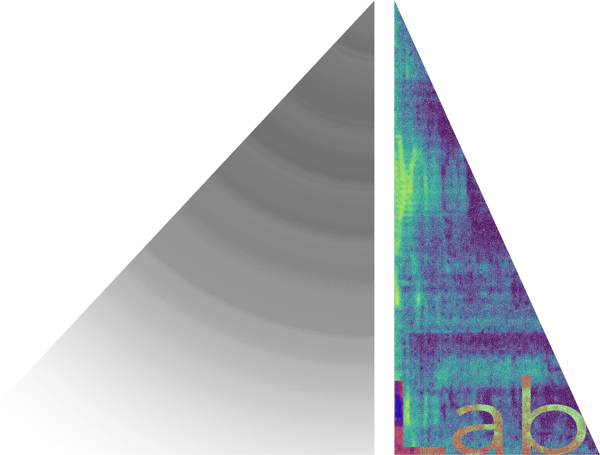
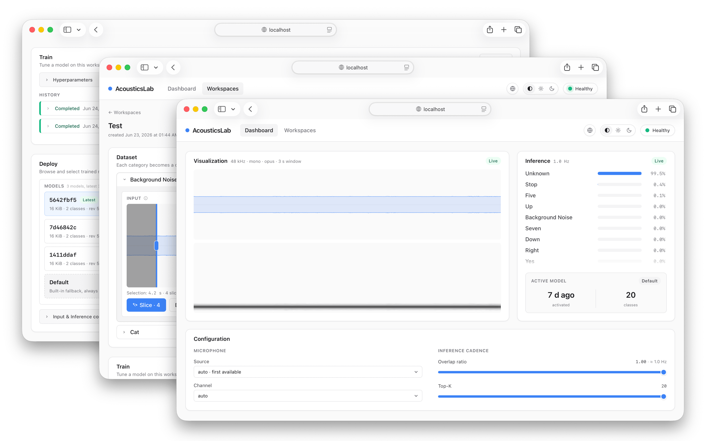

<div>
  
  <h3>AcousticsLab Next</h3>
  <p>A private, multi-backend, fully-local AI/ML toolkit for the seamless development and deployment of real-time sound event detection on embedded Linux systems.</p>
</div>
<div align="left" style="display: flex; flex-wrap: wrap; gap: 6px;">
  
  
  
  <a href="LICENSE"></a>
</div>
<div>
  
</div>

The next generation of [AcousticsLab](https://github.com/ekarad1um/AcousticsLab/tree/main), powered by a self-contained Rust backend with hybrid NPU/CPU inference engine and an intuitive Web console, delivering a fully-local, lightweight, efficient, end-to-end platform for acoustics analysis.


## Why AcousticsLab

- **Fully-local & Private** - Zero telemetry and no cloud dependency, audio and datasets remain strictly on your hardware, ~99% accuracy for causal tasks.
- **Low latency & Efficient** - Heterogeneous inference pipeline, processes 1-second data in ~4.9 ms on RV1126B, keeping CPU free for other tasks.
- **Tiny footprint** - On-device finetuning with 0.1GB RAM (~60 samples), inference consumes only ~18 MB RSS and < 5% CPU, packaged as a single, dependency-free binary.
- **Browser-based edge lab** - Manage datasets, fine-tune models, deploy directly from an intuitive web UI—no cloud GPU needed.
- **Universal compatibility** - Pairs native NPU acceleration with automatic CPU fallback to run seamlessly across practically any Linux SBC.
- **Seamless integration** - Easy export, import & distributed deploy across different architectures and NPU capabilities with same weights, zero-downtime by model hot-swapping, integrates with your stack via WebSockets, Unix sockets, and a standard HTTP/JSON + SSE control plane.


## Quick start

**Prerequisites:** Rust 1.94+ (edition 2024), `protoc` 3.21+, `cmake` 3.5+.

1. Run the `acousticslabd` daemon (host/dev build, uses a mock tone if no real mic is configured):

  ```bash
  cargo run --release --bin acousticslabd -- --workspace misc/workspace --config misc/etc/launch.toml
  ```

  The bundled `misc/etc/launch.toml` binds the HTTP/WebSocket API to `127.0.0.1:8787`.

2. Open the console (in another shell):

  ```bash
  cd web && npm install && npm run dev
  ```

  Open the URL Vite prints; it proxies the API and streams to the daemon.

*Note: stay tuned for pre-built binaries and package manager releases.*


## How it works

The `acousticslabd` is a single binary that owns the real-time audio path,  hybrid CPU/NPU pipeline and exposes the HTTP/SSE control plane, the browser SPA is a pure client.

```mermaid
flowchart TB
  daemon_note["<b>Backend (acousticslabd)</b><br/>single binary · composition root<br/>tokio · DrainRegistry · common / proto"]

  subgraph g_inputs["Inputs · hardware · boot config"]
    mic(["<b>Microphone</b><br/>ALSA capture device"])
    disk_toml["<b>launch.toml / config.toml</b><br/>boot manifest · hot-reload prefs"]
  end

  subgraph g_config["Configuration · config"]
    cfg_launch["<b>LaunchConfig</b><br/>immutable boot manifest"]
    cfg_cell["<b>ConfigCell</b><br/>hot-reload ArcSwap (Config)<br/>notify watcher · debounce"]
    cfg_mic["<b>MicSettingsCell</b><br/>VersionedSwap (MicSettings)<br/>catalogue · policy"]
    cfg_inf["<b>InferenceCfg</b><br/>live ArcSwap<br/>hop_samples · top_k"]
  end

  subgraph g_capture["Audio Capture · audio_io · audio_buffer · dsp"]
    arb["<b>MicArbitrator</b><br/>real-time thread · RMS arbitration · failover<br/>resample -> 44.1 kHz mono"]
    buf["<b>AudioBuffer</b><br/>wait-free seqlock ring (~5.94 s)"]
    anchor["<b>SharedTimingAnchor</b><br/>first-sample capture time"]
  end

  subgraph g_proc["Processing · inference · opus_stream · preproc"]
    opus["<b>OpusEngine</b><br/>44.1 -> 48 kHz · 20 ms Opus frames<br/>pauses at 0 subscribers"]
    engine["<b>InferenceEngine</b><br/>blocking worker · sliding window · hop<br/>emits InferenceFrame"]
    preproc["<b>Preproc</b><br/>CPU STFT (SIMD) -> 43 × 232 log-mag z-norm"]
    bb_dyn["<b>Backbone</b><br/>dyn trait seam · load_first_supported<br/>4-conv -> 2000-dim features"]
    head["<b>HotHead</b><br/>Linear 2000 -> N · softmax -> top-k<br/>hot-swappable · ACSTHEAD .mpk"]
    subgraph g_backbone["Backbone impls · exactly one active"]
      rknn_bb["<b>RknnBackbone</b><br/>NPU · fp16"]
      burn_bb["<b>BurnBackbone</b><br/>CPU · fp32"]
    end
    rknn["<b>rknn_runtime</b><br/>NPU FFI · dlopen librknnrt.so"]
  end

  npu(["<b>Rockchip NPU</b><br/>hardware accelerator"])

  subgraph g_transport["Streaming Transport · stream_io · proto"]
    router["<b>StreamRouter</b><br/>broadcast (Bytes) · audio · infer<br/>Envelope wire format (prost)"]
    ws["<b>WS Endpoints</b><br/>/stream/audio · /stream/infer"]
    udsout["<b>Inference UDS</b><br/>raw length-prefixed Envelope"]
  end

  uds_consumer(["<b>External Consumer</b><br/>local C / C++ · Envelope reader"])
  gw(["<b>Reverse Proxy</b><br/>e.g. nginx · TLS · auth · CORS"])

  subgraph g_browser["Browser SPA · web/ (SvelteKit · adapter-static)"]
    fe_stream["<b>Stream Worker</b><br/>2× WebSocket · WebCodecs Opus decode"]
    fe_ui["<b>UI</b><br/>routes · pages · components · i18n"]
    fe_stores["<b>Rune Stores</b><br/>reactive client state"]
    fe_api["<b>API Client</b><br/>REST · SSE · model import / export"]
    fe_dsp["<b>Browser DSP</b><br/>record · slice · FFT spectrogram"]
    fe_idb[("<b>IndexedDB</b><br/>local dataset cache · sha256-addressed")]
  end

  subgraph g_api["Control Plane · API"]
    api_routes["<b>API Routes</b><br/>/api/v1/* · REST · SSE<br/>uniform error envelope"]
    api_state["<b>AppState</b><br/>shared trait-handle hub"]
  end

  subgraph g_jobs["Cold-path Jobs · training · converter"]
    training["<b>training</b><br/>fine-tune head · frozen backbone · SGD"]
    converter["<b>converter</b><br/>import TFJS / ALPKG -> head.mpk"]
  end

  subgraph g_storage["Persistence · file_mgr"]
    fs["<b>FsService</b><br/>atomic writes · per-workspace mutex"]
    jobreg["<b>JobRegistry</b><br/>admission · leases · SSE events"]
    rotation["<b>head_rotation / active_head_writer</b><br/>stage -> validate -> publish -> install"]
    recovery["<b>recovery / storage_reaper</b><br/>boot drain · orphan sweep"]
  end

  status["<b>StatusMonitor</b><br/>heartbeats · sysinfo -> GET /status"]

  subgraph g_disk["Daemon-owned filesystem"]
    disk_ws[("<b>workspaces/</b><br/>datasets · heads · logs · .tmp")]
    disk_active[("<b>active/</b><br/>current.json · generations/")]
    disk_back[("<b>backbone artifacts</b><br/>backbone.rknn · backbone.mpk (read-only)")]
  end

  mic ==>|"PCM periods"| arb
  arb ==>|"Writer::push"| buf
  buf ==>|"Reader::peek"| opus
  opus ==>|"audio_tx · Envelope (Opus)"| router
  buf ==>|"Reader::peek"| engine
  engine ==>|"PCM window"| preproc
  preproc ==>|"spectrogram 43 × 232"| bb_dyn
  bb_dyn ==>|"2000-dim features"| head
  head ==>|"top-k -> infer_tx"| router
  router ==>|"per subscriber"| ws
  ws ==>|"WS binary"| gw
  gw ==>|"wss /stream/*"| fe_stream
  router -->|"infer only"| udsout
  udsout -->|"length-prefixed Envelope"| uds_consumer
  rknn_bb -->|"Session::infer"| rknn
  bb_dyn -.->|"impl · NPU"| rknn_bb
  bb_dyn -.->|"impl · CPU (host / dev)"| burn_bb
  arb -.->|"store"| anchor
  anchor -.->|"capture_us"| engine
  cfg_inf -.->|"load() per frame"| engine
  cfg_mic -.->|"snapshot() · wait-free"| arb
  router -.->|"audio_subscribers · pause @ 0"| opus
  cfg_cell -.->|"store on reload"| cfg_inf
  cfg_cell -.-> cfg_mic
  cfg_launch -.->|"catalogue"| cfg_mic
  disk_toml <-->|"load · atomic write · watch"| cfg_cell
  cfg_launch -.->|"backbone catalogue"| bb_dyn
  fe_api -->|"HTTPS · SSE"| gw
  gw -->|"HTTP (proxied)"| api_routes
  api_routes --- api_state
  api_state -->|"workspaces · assets · heads"| fs
  api_state -->|"POST /train"| training
  api_state -->|"POST /convert"| converter
  api_state -->|"admission · GET /jobs"| jobreg
  api_state -->|"POST /inference · /mic"| cfg_cell
  api_state -->|"GET /status"| status
  training ==>|"publish_trained_head"| rotation
  converter ==>|"publish_imported_head"| rotation
  rotation ==>|"install_prevalidated · POST /active"| head
  training -.->|"lifecycle events"| jobreg
  jobreg -.->|"SSE job events"| api_routes
  fs <-->|"atomic workspace I/O"| disk_ws
  rotation <-->|"generations · current.json"| disk_active
  recovery <-->|"boot drain · orphan sweep"| disk_ws
  training -->|"read datasets · write logs"| disk_ws
  bb_dyn -->|"load @ boot (.rknn / .mpk)"| disk_back
  rknn <-->|"dlopen · rknn_run"| npu
  engine -.->|"heartbeat (every subsystem)"| status
  fe_stream -->|"topics"| fe_stores
  fe_ui <-->|"state · actions"| fe_stores
  fe_stores -->|"REST · SSE"| fe_api
  fe_stores <-->|"cache"| fe_idb
  fe_dsp -.->|"WAV slices"| fe_stores
  fe_dsp -->|"spectrogram PNG"| fe_idb
  daemon_note -.->|"composition root"| api_state

  classDef ext fill:#f2f4f4,stroke:#7f8c8d,color:#2c3e50;
  classDef note fill:#fcf3cf,stroke:#b7950b,color:#7e5109;
  classDef cfg fill:#d4efdf,stroke:#1e8449,color:#145a32;
  classDef cap fill:#fadbd8,stroke:#c0392b,color:#922b21;
  classDef proc fill:#fae5d3,stroke:#ca6f1e,color:#9c640c;
  classDef bb fill:#fdebd0,stroke:#ca6f1e,color:#9c640c;
  classDef trans fill:#fae5d3,stroke:#ca6f1e,color:#9c640c;
  classDef ui fill:#dbe9f6,stroke:#2471a3,color:#1b4f72;
  classDef api fill:#d4e6f1,stroke:#2471a3,color:#1b4f72;
  classDef jobs fill:#e8daef,stroke:#7d3c98,color:#5b2c6f;
  classDef store fill:#fae5c3,stroke:#b9770e,color:#7e5109;
  classDef swap fill:#e8daef,stroke:#6c3483,color:#5b2c6f;
  classDef obs fill:#eaecee,stroke:#839192,color:#2c3e50;
  classDef disk fill:#fdf2e3,stroke:#b9770e,color:#7e5109;

  class mic,npu,gw,uds_consumer ext;
  class daemon_note,disk_toml note;
  class cfg_launch,cfg_cell,cfg_mic,cfg_inf,anchor,fe_idb cfg;
  class arb,buf,opus cap;
  class engine,preproc,bb_dyn,rknn proc;
  class rknn_bb,burn_bb bb;
  class router,ws,udsout trans;
  class fe_stream,fe_ui,fe_stores,fe_api,fe_dsp ui;
  class api_routes,api_state api;
  class training,converter jobs;
  class fs,jobreg,recovery store;
  class head,rotation swap;
  class status obs;
  class disk_ws,disk_active,disk_back disk;

  linkStyle 0,1,2,3 stroke:#c0392b,stroke-width:2px
  linkStyle 4,5,6,7,8,9,10,11 stroke:#d35400,stroke-width:2px
  linkStyle 12,13,14 stroke:#d35400
  linkStyle 15,16 stroke:#566573
  linkStyle 17,18,19,20,21,22,23,24 stroke:#1e8449
  linkStyle 25,26 stroke:#7d6608
  linkStyle 27,28,29,30,31,32,33,34,35 stroke:#2471a3
  linkStyle 36,37,38 stroke:#6c3483,stroke-width:2px
  linkStyle 39,40 stroke:#95a5a6
  linkStyle 41,42,43,44,45,46 stroke:#7d6608
  linkStyle 47 stroke:#95a5a6
```




*Note: thick edges are the real-time data plane (red = audio -> Opus, orange = inference -> top-k); solid blue is the HTTP/SSE control plane; dotted edges are config/shared state (green), job events (gray) and trait realizations; brown is durable disk I/O; purple is the classifier-head lifecycle (publish -> atomic hot-swap). Node colour groups by subsystem.*


## License

This software is licensed under the Apache License 2.0, see [LICENSE](LICENSE) for more information.
