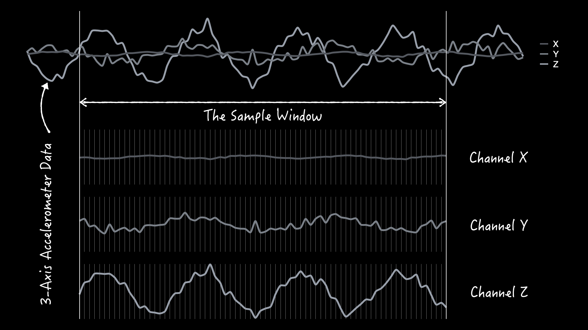
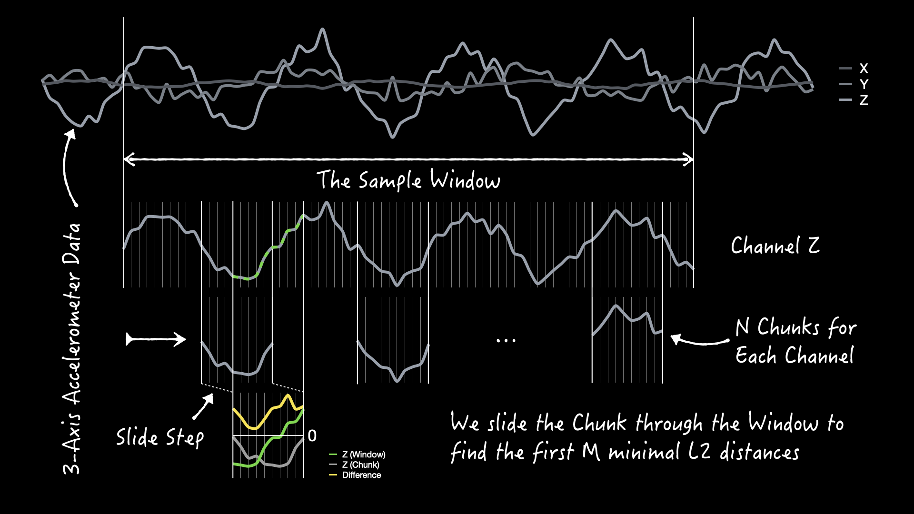
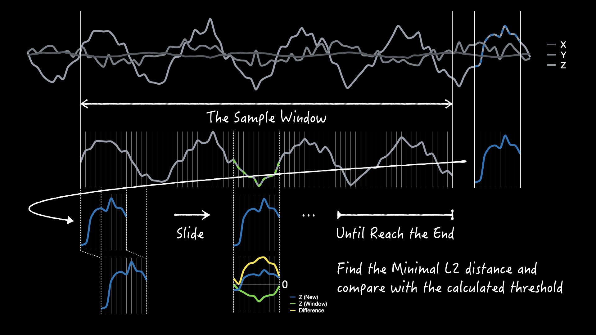

# Overview of the GEDAD Algorithm

Here we provide a detailed explanation of the **G**yroscope **E**uclidean **D**istance **A**nomaly **D**etection (GEDAD) algorithm, which initially developed for gyroscopes, and now it has been extended to 3-axis accelerometers while retaining its original name. The GEDAD algorithm consists of two core phases: **learning** and **inference**.

### Data Acquisition and Pre-processing

The process begins with data acquisition. While vibration data is collected from a 3-axis accelerometer via I2C and stored in a circular buffer, later the data undergoes a linear transformation where it is multiplied by a coefficient `alpha`, and added with another coefficient `beta`.

### Learning Phase

The objective of the learning phase is to establish a **baseline template of normal vibration** for the measuring device.

1.  **Template Generation**: First, a `sliding window` of 3-axis acceleration data, sized to cover a complete normal operational cycle, is collected to serve as the **template data**.
2.  **Distance Calculation**: The algorithm then randomly samples `N` short data segments or named `chunks` from identical positions within each channel of the template. Each chunk is then slid across the entire template of its corresponding channel with a defined `sliding step`, calculating the Euclidean (L2) distance at each position.
3.  **Threshold Calculation**: Next, outliers are filtered from these distances (e.g., using the 3σ rule; specifically, values less than a given EPS). For each channel, the remaining distances are sorted to identify the `M` smallest values. An average **threshold** is then computed for each channel from these `M` distances, defining the boundary between normal and abnormal states.
4.  **Parameter Calibration**: Finally, an additional parameter, `C`, is determined by finding the median counts of consecutive instances where the Euclidean distance is below the threshold during a subsequent comparison. This parameter is stored to enhance detection accuracy in the next phase.

### Inference Phase

During inference, the algorithm compares real-time 3-axis acceleration data against the established **template data** to identify any vibrations that do not match the normal *fingerprint*.

The process is similar to training, but it uses real-time data segments for comparison instead of randomly sampled `chunks`.

  * If the real-time data segment is sufficiently similar to a portion of the template (i.e., its Euclidean distance is below the threshold), the vibration is deemed **normal**.
  * Conversely, if the distance remains above the threshold after comparison against the entire template, the system flags the vibration as an **anomaly**.

The actual computation is more complex, involving the fusion of anomaly scores across channels and the use of the parameter `C`.

## Summary and Future Work

In summary, the algorithm's advantages include:

  * Fast training speed
  * Low computational overhead
  * Suitability for low-power embedded devices
  * Requires only a small amount of normal data for training

We are also exploring engineering optimizations, such as using Fast Fourier Transform (FFT) to analyze frequency components and considering time-frequency characteristics and average amplitude. Future work will focus on further enhancing the algorithm's accuracy, efficiency and robustness.
